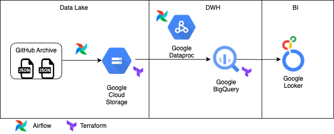
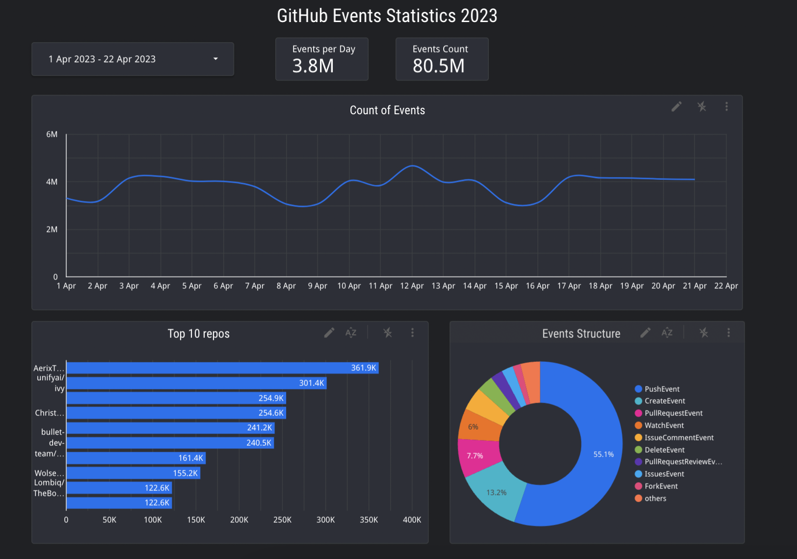
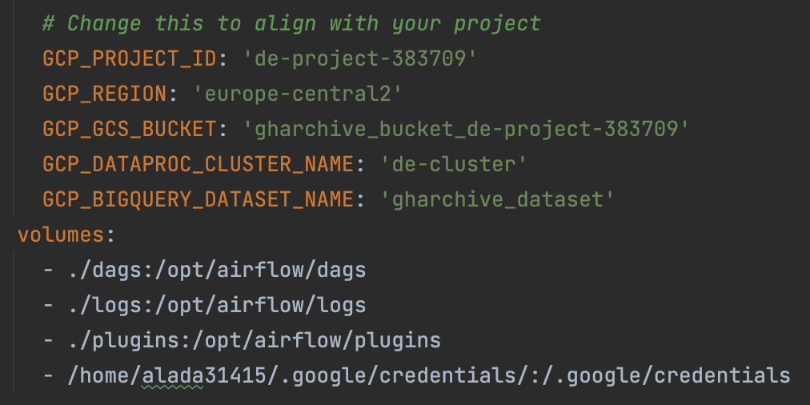
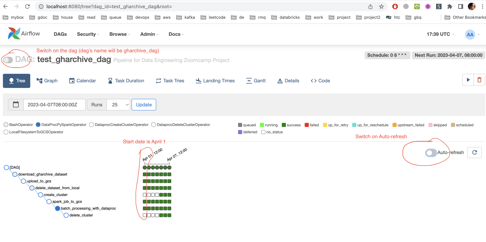

# Data Engineering Zoomcamp Project
This is my project for the [Data Engineering Zoomcamp](https://github.com/DataTalksClub/data-engineering-zoomcamp) by [DataTalks.Club](https://datatalks.club/)

## Index
- [Data Engineering Zoomcamp Project](#data-engineering-zoomcamp-project)
    - [Index](#index)
    - [Problem Statement](#problem-statement)
    - [About the Dataset](#about-the-dataset)
    - [Architecture](#architecture)
    - [Technologies/Tools](#technologiestools)
    - [About the Project](#about-the-project)
    - [Dashboard](#dashboard)
    - [Reproducibility](#reproducibility)
        - [Pre-Requisites](#pre-requisites)
            - [Google Cloud Platform Account](#google-cloud-platform-account)
            - [Create a Service Account](#create-a-service-account)
            - [Pre-Infrastructure Setup](#pre-infrastructure-setup)
                - [Setting up a Virtual Machine on GCP](#setting-up-a-virtual-machine-on-gcp)
                - [Setting up a DataProc Cluster on GCP](#setting-up-a-dataproc-cluster-on-gcp)
            - [Installing Required Packages on the VM](#installing-required-packages-on-the-vm)
                - [SSH Key Connection](#ssh-key-connection)
                - [Google Cloud SDK](#google-cloud-sdk)
                - [Docker](#docker)
                - [Docker-Compose](#docker-compose)
                - [Terraform](#terraform)
                - [Google Application Credentials](#google-application-credentials)
                - [Remote-SSH](#remote-ssh)
        - [Main](#main)
            - [Clone the repository](#clone-the-repository)
            - [Create remaining infrastructure with Terraform](#create-remaining-infrastructure-with-terraform)
            - [Copy PySpark file to Google Cloud Storage](#copy-pyspark-file-to-google-cloud-storage)
            - [Initialise Airflow](#initialise-airflow)
            - [Run the pipeline](#run-the-pipeline)
    - [Notable Notes](#notable-notes)
    - [Acknowledgements](#acknowledgements)

## Problem Statement
- You would like to research GitHub activity to find out some trends. 
- You have data about GitHub events for April 2023.
- Here are some questions that you want to answer:
    - How many events happen on GitHub daily?
    - What is the most popular type of event?
    - What are the top 10 most active repos?

## About the Dataset
[Github Archive](https://www.gharchive.org/) is a project to record the public Github timeline, archive it, and make it accessible for further analysis.
## Architecture


<p align="right"><a href="#index">back to index</a></p>

## Technologies/Tools
- Containerisation - [Docker](https://www.docker.com/)
- Infrastructure-as-Code (IaC) - [Terraform](https://www.terraform.io/)
- Cloud - [Google Cloud Platform](https://cloud.google.com/)
- Workflow Orchestration - [Airflow](https://airflow.apache.org/)
- Data Lake - [Google Cloud Storage](https://cloud.google.com/storage)
- Data Warehouse - [Google BigQuery](https://cloud.google.com/bigquery)
- Batch Processing - [Google DataProc](https://cloud.google.com/dataproc) 
- Visualisation - [Google Data Studio](https://datastudio.google.com/)
## About the Project
- Starting from April 1, Github Archive data is ingested daily into Google Cloud Storage
- A PySpark job is run on the data in GCS using Google DataProc
- The results are written to 2 pre-defined tables in Google BigQuery
- A dashboard is created from the BigQuery tables
- Cloud resources (Storage bucket, BigQuery tables) are created with Terraform
- Extract & load scripts and PySpark Job are orchestrated with Airflow
- Dataproc cluster is created with Airflow and is deleted after the job completes
## Dashboard
Dashboard is build in Looker Studio and publicly available on this [link](https://lookerstudio.google.com/s/nLd0g4D8ap4)

In case dashboard is not accessible there is an image below: 


<p align="right"><a href="#index">back to index</a></p>

## Reproducibility

### Pre-Requisites

#### Google Cloud Platform Account
1. Create a [GCP](https://cloud.google.com/) account if you do not have one. Note that GCP offers $300 free credits for 90 days
2. Create a new project from the GCP [dashboard](https://console.cloud.google.com/). Note your project ID
#### Create a Service Account
1. Go to _IAM & Admin > Service Accounts_
2. Click _Create Service Account_. More information [here](https://cloud.google.com/docs/authentication/getting-started#creating_a_service_account)
3. Add the following roles to the service account:
    - _Viewer_
    - _Storage Admin_
    - _Storage Object Admin_
    - _BigQuery Admin_
    - _DataProc Administrator_
4. Download the private JSON keyfile. Rename it to `google_credentials.json` and store it in `${HOME}/.google/credentials/`
5. You would need to enable this APIs if you have not done already
    - [IAM API](https://console.cloud.google.com/apis/library/iam.googleapis.com)
    - [IAM Service Account Credentials API](https://console.cloud.google.com/apis/library/iamcredentials.googleapis.com)
    - [Cloud Dataproc API](https://console.cloud.google.com/apis/library/dataproc.googleapis.com)

<p align="right"><a href="#index">back to index</a></p>

#### Pre-Infrastructure Setup
Terraform is used to setup most of the infrastructure but the Virtual Machine was created on the cloud console. Follow the instructions below to create a VM.
> You can also use your local machine to reproduce this project but it is much better to use a VM. If you still choose to use your local machine, install the necessary packages on your local machine.

##### Setting up a Virtual Machine on GCP
1. On the project dashboard, go to _Compute Engine > VM Instances_
2. Create a new instance
    - Use any name of your choosing
    - Choose a [region](https://cloud.google.com/about/locations) that suits you most
        > All your GCP resources should be in the same region
    - For machine configuration, choose the E2 series. An _e2-standard-2 (2 vCPU, 8 GB memory)_ is sufficient for this project
    - In the Boot disk section, change it to _Ubuntu_ preferably _Ubuntu 20.04 LTS_. A disk size of 30GB is also enough.
    - Leave all other settings on default value and click _Create_
> You would need to enable the [Compute Engine API](https://console.cloud.google.com/apis/library/compute.googleapis.com) if you have not already.

<p align="right"><a href="#index">back to index</a></p>

#### Installing Required Packages on the VM
Before installing packages on the VM, an SSH key has to be created to connect to the VM

##### SSH Key Connection
1. To create the SSH key, check this [guide](https://cloud.google.com/compute/docs/connect/create-ssh-keys)
2. Copy the public key in the `~/.ssh` folder
3. On the GCP dashboard, navigate to _Compute Engine > Metadata > SSH KEYS_
4. Click _Edit_. Then click _Add Item_. Paste the public key and click _Save_
5. Go to the VM instance you created and copy the _External IP_
6. Go back to your terminal and type this command in your home directory
    ```bash
    ssh -i <path-to-private-key> <USER>@<External IP>
    ```
    - This should connect you to the VM
8. When you're through with using the VM, you should always shut it down. You can do this either on the GCP dashboard or on your terminal
    ```bash
    sudo shutdown now
    ```
##### Google Cloud SDK
Google Cloud SDK is already pre-installed on a GCP VM. You can confirm by running `gcloud --version`.  
If you are not using a VM, check this [link](https://cloud.google.com/sdk/docs/install-sdk) to install it on your local machine
##### Docker
1. Connect to your VM
2. Install Docker
    ```bash
    sudo apt-get update
    sudo apt-get install docker.io
    ```
3. Docker needs to be configured so that it can run without `sudo`
    ```bash
    sudo groupadd docker
    sudo gpasswd -a $USER docker
    sudo service docker restart
    ```
    - Logout of your SSH session and log back in
    - Test that docker works successfully by running `docker run hello-world`
##### Docker-Compose
1. Check and copy the latest release for Linux from the official Github [repository](https://github.com/docker/compose)
2. Create a folder called `bin/` in the home directory. Navigate into the `/bin` directory and download the binary file there
    ```bash
    wget <copied-file> -O docker-compose
    ```
3. Make the file executable 
    ```bash
    chmod +x docker-compose
    ```
4. Add the `.bin/` directory to PATH permanently
    - Open the `.bashrc` file in the HOME directory
    ```bash
    nano .bashrc
    ```
    - Go to the end of the file and paste this there 
    ```bash
    export PATH="${HOME}/bin:${PATH}"
    ```
    - Save the file (_CTRL-O_) and exit nano (_CTRL-X_)
    - Reload the PATH variable
    ```bash
    source .bashrc
    ```
5. You should be able to run docker-compose from anywhere now. Test this with `docker-compose --version`
##### Terraform
1. Navigate to the `bin/` directory that you created and run this
    ```bash
    wget https://releases.hashicorp.com/terraform/1.1.7/terraform_1.1.7_linux_amd64.zip
    ```
2. Unzip the file
    ```bash
    unzip terraform_1.1.7_linux_amd64.zip
    ```
    > You might have to install unzip `sudo apt-get install unzip`
3. Remove the zip file
    ```bash
    rm terraform_1.1.7_linux_amd64.zip
    ```
4. Terraform is already installed. Test it with `terraform -v`
##### Google Application Credentials
The JSON credentials downloaded is on your local machine. We are going to transfer it to the VM using `scp`
1. On your local machine, navigate to the location of the credentials file `${HOME}/.google/google_credentials.json`
2. Copy credentials file to vm 
    ```
    scp google_credentials.json <you vm user>@<vm external IP>:/home/<your vm user>/.google/credentials/google_credentials.json
    ```
    
3. Connect to your vm using ssh `ssh -i /path/to/private/ssh/key <your vm user>@<vm external IP>` and check, that the file is there `ls ~/.google/credentials`
4. For convenience, add this line to the end of the `.bashrc` file
    ```bash
    export GOOGLE_APPLICATION_CREDENTIALS=${HOME}/.google/credentials/google_credentials.json
    ```
    - Refresh with `source .bashrc`
5. Use the service account credentials file for authentication
    ```bash
    gcloud auth activate-service-account --key-file $GOOGLE_APPLICATION_CREDENTIALS
    ```
##### Remote-SSH
To work with folders on a remote machine on Visual Studio Code, you need this extension. This extension also simplifies the forwarding of ports.
1. Install the Remote-SSH extension from the Extensions Marketplace
2. At the bottom left-hand corner, click the _Open a Remote Window_ icon
3. Click _Connect to Host_. Click the name of your config file host.
4. In the _Explorer_ tab, open any folder on your Virtual Machine
Now, you can use VSCode completely to run this project.

<p align="right"><a href="#index">back to index</a></p>

### Main

#### Clone the repository
```bash
    git clone https://github.com/alinali87/de-zoomcamp-project.git
```
#### Create remaining infrastructure with Terraform
We use Terraform to create a GCS bucket, a BQ dataset, and 2 BQ tables
1. Navigate to the [terraform](./terraform/) folder
2. Initialise terraform
    ```bash
    terraform init
    ```
3. Check infrastructure plan
    ```bash
    terraform plan
    ```
4. Create new infrastructure
    ```bash
    terraform apply
    ```
5. Confirm that the infrastructure has been created on the GCP dashboard

#### Initialise Airflow
Airflow is run in a docker container. This section contains steps on initisialing Airflow resources
1. Navigate to the [airflow](./airflow/) folder
2. Create a logs folder `airflow/logs/`
    ```bash
    mkdir logs/
    ```
3. Build the docker image
    ```bash
    docker-compose build
    ```
4. The names of some project resources are hardcoded in the [docker_compose.yaml](./airflow/docker-compose.yaml) file. Change this values to suit your use-case
    
5. Initialise Airflow resources
    ```bash
    docker-compose up airflow-init
    ```
6. Kick up all other services
    ```bash
    docker-compose up
    ```
7. Open another terminal instance and check docker running services
    ```bash
    docker ps
    ```
    - Check if all the services are healthy
8. Forward port **8080** from VS Code. Open `localhost:8080` on your browser and sign into airflow
    > Both username and password is `airflow`
#### Run the pipeline
You are already signed into Airflow. Now it's time to run the pipeline
1. Click on the DAG `gharchive_dag` that you see there
2. You should see a tree-like structure of the DAG you're about to run

3. At the top right-hand corner, trigger the DAG. Make sure _Auto-refresh_ is turned on before doing this
    > The DAG would run from April 1 at 8:00am UTC till 8:00am UTC of the present day  
    > This should take a while
4. While this is going on, check the cloud console to confirm that everything is working accordingly
    > If you face any problem or error, confirm that you have followed all the above instructions religiously. If the problems still persist, raise an issue.
5. When the pipeline is finished, and you've confirmed that everything went well, shut down **docker-compose* with _CTRL-C_ and kill all containers with `docker-compose down`
6. Take a well-deserved break to rest. This has been a long ride.

<p align="right"><a href="#index">back to index</a></p>

## Notes
- Partitioning and Clustering is pre-defined on the tables in the data warehouse. You can check the definition in the main terraform [file](./terraform/main.tf)
- Dataproc configuration is in the [gharchive_dag.py](./airflow/dags/gharchive_dag.py) file.

## Acknowledgements
I'd like to thank the organisers of this wonderful course. It has given me valuable insights into the field of Data Engineering. Also, all fellow students who took time to answer my questions on the Slack channel, thank you very much.

<p align="right"><a href="#index">back to index</a></p>
